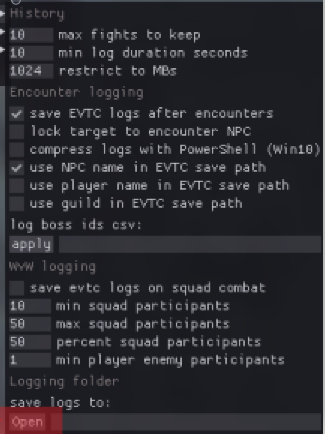
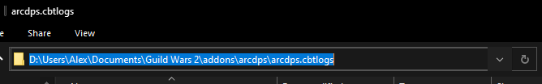
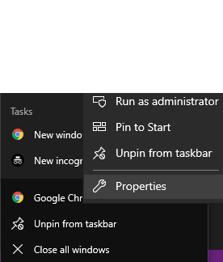
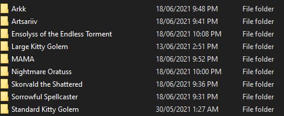

# <font color ="#0c419c"> ArcAgent </font>

* ArcAgent is a quick and easy tool for collating your latest Gw2 encounters and automatically submit them for upload.
* Click of a single button to upload all your latest runs!
* Can open your latest runs straight into your web-browser!
* Allows any encounters that produce the `.evtc` ArcDPs Logs.

# <font color ="#4ab0f0"> Running </font>

* To run: download this repository,
* Ensure you have [.NET Core 3.1+ runtime](https://dotnet.microsoft.com/download/dotnet/3.1/runtime) 
* Ensure all configurations are added to the `config/config.json` file. Seee below for more information. 
* click and run `ArcAgent.exe`.
* If you get stuck, Check the `/logs` folder for any errors, or debugging information.


# <font color ="#4ab0f0"> Configuration </font>

<h2><font color="#4f6166">logs_directory - REQUIRED</font></h2>


* The directory where your ArcDPS logs are stored.  You can determine this by pressing `alt + shift + T`, navigate to `Logging` then click `Open`. 
* Note - use `/` instead of `\` between subfolders

<p align="center">
  
</p>

* The folder that opens is the path to your ArcDPS logs.
<br>

<p align="center">
  
</p>

---
<h2><font color="#4f6166">output_directory</font></h2>
<br>

* The folder where your put file will be stored for daily run results.
* Each time you run the application, a file marked with todays date will be created containing.
* * Note - use `/` instead of `\` between subfolders

```log
23:54:14.8407750
Arkk - https://dps.report/HPGL-20210616-201336_arkk
Artsariiv - https://dps.report/RBVI-20210616-200951_arriv
Ensolyss of the Endless Torment - https://dps.report/f6UX-20210616-202409_enso
MAMA - https://dps.report/H6LD-20210616-201640_mama
Nightmare Oratuss - https://dps.report/CpXA-20210616-202125_siax
Skorvald the Shattered - https://dps.report/mkNZ-20210616-200440_skor
Sorrowful Spellcaster - https://dps.report/fjzD-20210616-200058_ai

```
---
<h2><font color="#4f6166">auto_browser_open</font></h2>
<br>

* This flag controls whether ArcAgent will open all of your logs in a web-browser of your choice.
* Accepted values `true` or `false`
---

<h2><font color="#4f6166">browser_app_path</font></h2>
<br>

* This property works in conjunction with `auto_browser_open`.
* If `auto_browser_open` is set to `true`, ArcAgent will try open a web-browser with each of your logs in a seperate tab. 
* This property should be set to the folder that contains your browser executable.
* To determine this, right click on your browser, click `Properties`, then use the value of the `target`.
 <p align="center">
  
</p>

e.g. 
> "C:/Program Files/Google/Chrome/Application/chrome.exe"
---

* Note - use `/` instead of `\` between subfolders

<h2><font color="#4f6166">same_day_only</font></h2>
<br>

* This flag controls whether ArcAgent collects and uploads daily runs only. 
* If this set to `false`, the latest log will be uploaded irrespective if you ran it today. If this is set to `true`, then you may be presented with a prompt:
  > "no daily runs were found"

* This will happen if you haven't run any bosses from the listed `encounters` today (thus far). 
* Accepted values: `true` or `false`

<br>
<h2><font color="#4f6166">encounters- REQUIRED</font></h2>
<br>

*  A list of encounters which will be used to determine which boss encounters to collect and upload. 
*  The values here need to match with the folders in your `logs_directory`.

 <p align="center">
  
</p>


* The structure of this property should be as follows.
```json
  "encounters": [
        "Arkk",
        "Artsariiv",
        "Ensolyss of the Endless Torment",
        "MAMA",
        "Nightmare Oratuss",
        "Skorvald the Shattered",
        "Sorrowful Spellcaster"
    ]
```

<br>
---
<br>

# <font color ="#4ab0f0"> Example Config </font>

```json
{
    "logs_directory": "[FOLDER_WHERE_ARC_LOGS_SAVED]",
    "output_directory": "[FOLDER_WHERE_OUTPUT_FILE_WILL_GO]",
    "auto_browser_open": true,
    "browser_app_path": "[FOLDER_WHERE_WEBB_BROWSER_APPLICATION_IS]",
    "same_day_only":false,
    "encounters": [
        "Arkk",
        "Artsariiv",
        "Ensolyss of the Endless Torment",
        "MAMA",
        "Nightmare Oratuss",
        "Skorvald the Shattered",
        "Sorrowful Spellcaster"
    ]
}

```
